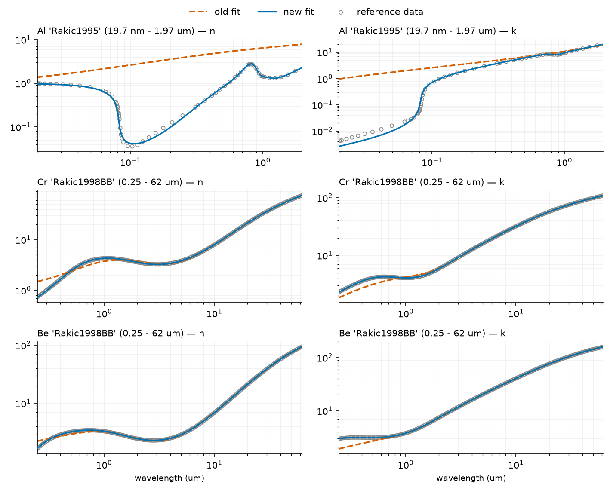
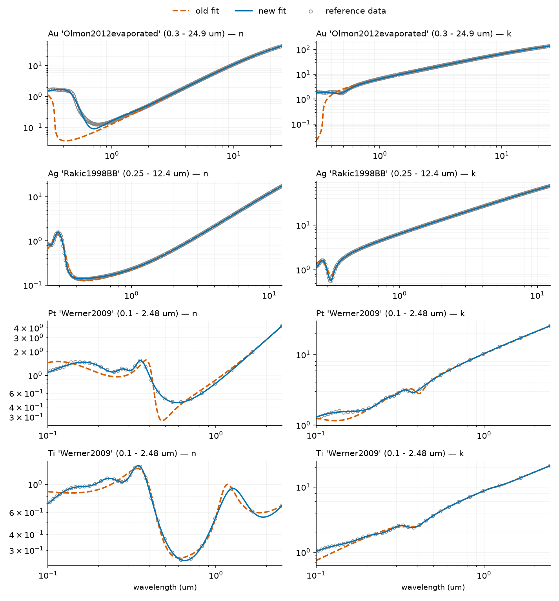

Starting with tidy3d 2.12, the pole-residue fits behind seven metal variants of the [material library](https://docs.flexcompute.com/projects/tidy3d/en/latest/api/material_library.html) were replaced, because the previous coefficients did not match their own reference datasets: `Al` `'Rakic1995'`, `Cr` `'Rakic1998BB'`, `Be` `'Rakic1998BB'`, `Au` `'Olmon2012evaporated'`, `Ag` `'Rakic1998BB'`, `Pt` `'Werner2009'`, and `Ti` `'Werner2009'`. Each of these is also the **default** variant for its material, so simulation results change wherever these materials are used — whether the variant is selected explicitly or via the default — across their entire (unchanged) validity ranges. The worst cases were large: aluminum returned a non-physical real index (n' of 5–7.5 across the visible and near-IR, where it should be roughly 0.8–1.8), and default gold had no interband response (n = 0.04 at 400 nm where its dataset gives 1.59).

## Old vs. new values

Refractive index (n, k) at representative wavelengths — reference data vs. the old and new fits:

| material (variant) | wavelength | data | old fit | new fit |
|---|---|---|---|---|
| Al ('Rakic1995') | 100 nm | 0.04, 0.70 | 2.62, 2.58 | 0.04, 0.71 |
| Al | 500 nm | 0.81, 6.05 | **5.12**, 6.64 | 0.82, 6.03 |
| Al | 1550 nm | 1.58, 15.66 | **7.29**, 15.26 | 1.59, 15.66 |
| Cr ('Rakic1998BB') | 637 nm | 3.35, 4.27 | **2.86, 3.57** | 3.35, 4.27 |
| Cr | 10 µm | 7.95, 31.77 | 7.91, 31.78 | 7.95, 31.77 |
| Be ('Rakic1998BB') | 300 nm | 2.20, 3.12 | 2.42, **2.12** | 2.21, 3.12 |
| Be | 10 µm | 6.88, 40.81 | 6.88, 40.80 | 6.88, 40.80 |
| Au ('Olmon2012evaporated') | 400 nm | 1.59, 1.92 | **0.04, 1.46** | 1.67, 1.84 |
| Au | 5 µm | 3.00, 34.31 | 2.99, 34.31 | 3.00, 34.32 |
| Ag ('Rakic1998BB') | 314 nm | 1.03, 0.57 | 1.00, **0.77** | 1.04, 0.58 |
| Ag | 800 nm | 0.19, 4.99 | 0.18, 4.99 | 0.19, 4.99 |
| Pt ('Werner2009') | 451 nm | 0.63, 3.76 | **0.33**, 3.57 | 0.63, 3.76 |
| Ti ('Werner2009') | 500 nm | 0.36, 3.64 | 0.33, 3.63 | 0.36, 3.64 |

The pattern: the old fits were fine in the infrared but wrong in the ultraviolet/visible. The new fits track the reference data at every tabulated point over each variant's full validity range, and all fits (old and new) are passive and stable.

Full-range comparison (data = circles, old fit = dashed, new fit = solid):

## Why the old fits were wrong

The aluminum, chromium, and beryllium coefficients regressed in a 2023 bulk re-fit of the library: fitting each dataset's *full* tabulated range with globally weighted least squares lets the infrared tail of a metal's permittivity (which is thousands of times larger than its visible value) dominate the objective, so the visible-band fit collapses while remaining perfectly passive — no physicality check could catch it. The gold, silver, platinum, and titanium fits were older, low-order fits that under-resolved the visible/interband structure of their datasets. The replacements were fit with an improved vector-fitting backend and are verified against the reference data at every tabulated point, with library-wide accuracy regression tests added so this cannot recur silently.

## Am I seeing old or new values? (quick check)

Evaluate the material at a probe wavelength and compare with the table above. The sharpest signatures:

- **Al**: n' greater than ~3 anywhere in 500–1700 nm means old (broken) coefficients; new gives n' = 0.82 / 1.59 at 500 / 1550 nm.
- **Au (default)**: n = 0.04 at 400 nm means old; new gives 1.67.
- **Pt**: n = 0.33 at 451 nm means old; new gives 0.63.
- **Cr**: n = 2.86 at 637 nm means old; new gives 3.35.

## Simulating only in the infrared? Use the `_IR` variants

The corrected fits need more poles (up to twice as many), and FDTD cost grows with pole count. Where the previous coefficients matched the reference data to within 2% at every tabulated point over a contiguous infrared band, they remain in the library as lower-cost `_IR` variants, with validity ranges narrowed to exactly those bands:

| variant | poles (vs. new default) | valid band |
|---|---|---|
| `td.material_library['Au']['Olmon2012evaporated_IR']` | 3 (vs. 5) | 3.5 – 24.93 µm |
| `td.material_library['Ag']['Rakic1998BB_IR']` | 3 (vs. 6) | 1.4 – 12.4 µm |
| `td.material_library['Cr']['Rakic1998BB_IR']` | 3 (vs. 6) | 3.2 – 62 µm |
| `td.material_library['Be']['Rakic1998BB_IR']` | 4 (vs. 8) | 1.0 – 62 µm |

Inside these bands the `_IR` variants are as accurate as the new defaults and match pre-update results, so they double as a reproducibility path for infrared studies. There is no `_IR` variant for Al (the old fit was inaccurate at all wavelengths, infrared included), nor for Pt/Ti (their dataset ends at 2.48 µm, so there is no infrared band to certify). Using a variant outside its valid band produces the standard validity-range warning.

## Reproducing results computed with the old coefficients

The recommended way to keep a study self-consistent is to pin the tidy3d version it started with. For infrared-band studies of Au, Ag, Cr, or Be, the `_IR` variants above *are* the old coefficients. Otherwise, the old coefficients can be used directly as custom media (they remain valid `PoleResidue` models — inaccurate against the reference data, but passive and stable):


import tidy3d as td

# Pre-update ('legacy') coefficients of the re-fit variants. These do NOT match
# the reference data (that is why they were replaced); use them only to
# reproduce results computed before the update.
LEGACY_MEDIUMS = {
    ("Al", "Rakic1995"): td.PoleResidue(
        eps_inf=1.0,
        poles=[
            ((-176076476399307.25-0j), (-2.0497198166085053e+17-0j)),
            ((-55958309702844.36-0j), (-1.9328759376610138e+18-0j)),
            ((-32886941985772.406-0j), (2.985600009810314e+17-0j)),
            ((-836904963.7321033-0j), (1.9664479588602982e+18-0j)),
        ],
        frequency_range=(151926744799612.75, 1.5192674479961274e+16),
    ),
    ("Cr", "Rakic1998BB"): td.PoleResidue(
        eps_inf=1.0,
        poles=[
            ((-73056488139432.73-0j), (-2.7457982793225763e+17-0j)),
            ((-145384800564.84518-0j), (2.8558672134946093e+17-0j)),
            ((-2137728163059224-740097502616341.5j), (5846984237158586+9.545555973191486e+16j)),
        ],
        frequency_range=(4835362227919.29, 1208840556979822.5),
    ),
    ("Be", "Rakic1998BB"): td.PoleResidue(
        eps_inf=1.0,
        poles=[
            ((-1737739552967275.2-0j), (2.3924381023090224e+16-0j)),
            ((-151352273074186.28-0j), (4367049766016236.5-0j)),
            ((-53296876831178.09-0j), (-6.001139611206947e+17-0j)),
            ((-20238020062.550835-0j), (6.055916356024831e+17-0j)),
        ],
        frequency_range=(4835978484543.8545, 1208994621135963.5),
    ),
    ("Au", "Olmon2012evaporated"): td.PoleResidue(
        eps_inf=5.632132676065586,
        poles=[
            ((-208702733035001.06-205285605362650.1j), (-5278287093117479+1877992342820785.5j)),
            ((-5802337384288.284-6750566414892.662j), (4391102400709820+6.164348337888482e+18j)),
            ((-56597670698540.76-8080114483410.944j), (895004078070708.5+5.346045584373232e+18j)),
        ],
        frequency_range=(12025369359446.29, 999308193769986.8),
    ),
    ("Ag", "Rakic1998BB"): td.PoleResidue(
        eps_inf=2.080628548409516,
        poles=[
            ((-74116405167315.4-0j), (-1.0385354711010449e+18-0j)),
            ((-199290207342.26654-0j), (1.0396417727844411e+18-0j)),
            ((-622425347820110.2-6539570627133650j), (936046890626063+1966533189396127.8j)),
        ],
        frequency_range=(24179892422719.273, 1208994621135963.5),
    ),
    ("Pt", "Werner2009"): td.PoleResidue(
        eps_inf=1.0,
        poles=[
            ((-9288886703545810-1.9809701816539028e+16j), (-2559720539992317+2.619854823299511e+16j)),
            ((-113303296165008.06-132666543091888.84j), (5059991338597539+1.459321906232765e+18j)),
            ((-525913270217765.06-4665172268701287j), (4280438237239983.5+1882099733932914.8j)),
        ],
        frequency_range=(120884055879414.03, 2997924585809468.0),
    ),
    ("Ti", "Werner2009"): td.PoleResidue(
        eps_inf=1.0,
        poles=[
            ((-1316659173032264.2-4853426451943540j), (6846803510207887+3451315459947241.5j)),
            ((-234898849175817.28-1643952885872075.5j), (-1039094910406333.4+2786587583155544.5j)),
            ((-9631968003009.37-107553157768951.47j), (5856843593653923+1.1954179403843133e+18j)),
        ],
        frequency_range=(120884055879414.03, 2997924585809468.0),
    ),
}
# example: reproduce pre-2.12 default aluminum
old_al = LEGACY_MEDIUMS[("Al", "Rakic1995")]



